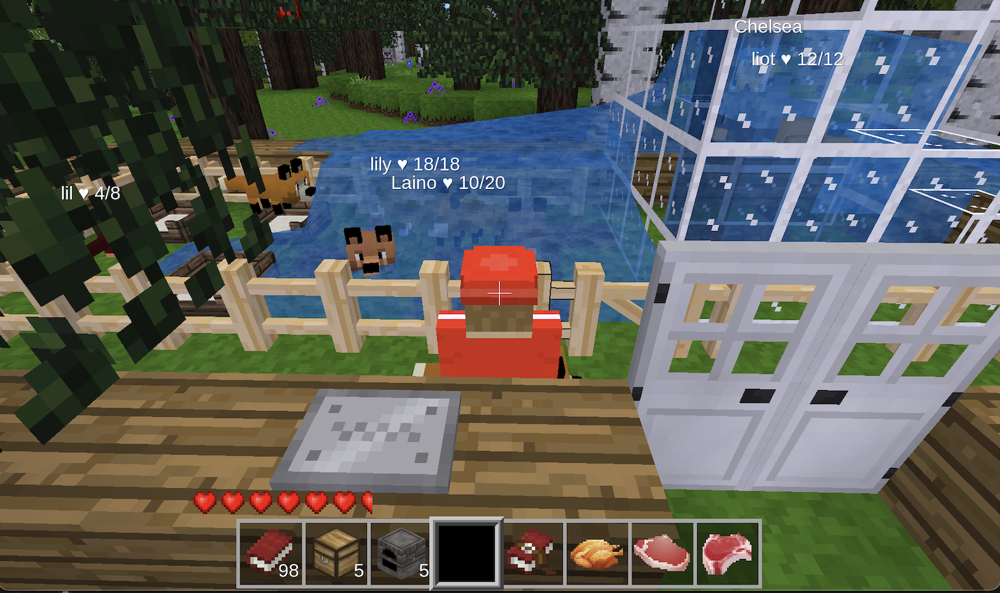

# Petz Modpack - ContentDB Submission Package

## 📦 Modpack Information

**Name**: Petz - Cute Mobs  
**Author**: toddllm  
**License**: GPLv3  
**Version**: 2.0.0  
**Min Luanti Version**: 5.4  
**Tested with**: Luanti 5.14.0-dev  

## 📝 Description

Add adorable creatures with advanced AI behaviors to your Luanti world! The Petz modpack includes a complete ecosystem of cute animals with sophisticated mob AI powered by the Kitz engine.

### 🐾 Features
- **20+ Different Animals**: Cats, dogs, farm animals, wildlife
- **Advanced AI**: Realistic behaviors, feeding, taming
- **Interactive Systems**: Pet care, breeding, training
- **Multiplayer Compatible**: Works seamlessly on servers
- **Modern APIs**: Fully updated for Luanti 5.14

## 🧩 Modpack Contents

### Kitz (Mob Engine API)
High-level mob API providing the foundation for advanced mob behaviors
- Animation engine with modern bone positioning
- Behavior trees and AI systems  
- Sound and effect management

### Petz (Main Mod)
The cute mobs implementation using Kitz engine
- Multiple animal types with unique behaviors
- Taming and feeding mechanics
- Mob interactions and breeding

### Bale (Farming Integration) 
Optional farming enhancements and mob-related items

## ⚙️ Installation

### Dependencies (Required)
- default
- stairs  
- dye
- farming
- vessels
- wool
- tnt
- player_api
- fire

### Optional Dependencies
- bonemeal (enhanced farming)
- 3d_armor (armor interactions)
- crops (additional farming)
- playerphysics (movement modifications)
- player_monoids (player state management)

## 🔧 Configuration

The modpack includes comprehensive configuration options in `petz.conf`:
- Animal spawn rates and behaviors
- Mob AI parameters
- Visual and audio settings
- Performance tuning options

## 🎮 Usage

1. **Finding Animals**: Explore different biomes to find various creatures
2. **Taming**: Use appropriate food items to tame animals
3. **Care**: Feed and interact with your pets regularly
4. **Breeding**: Create animal families with proper care
5. **Protection**: Keep animals safe from dangers

## 🧪 Compatibility

### ✅ Tested Environments
- **Luanti 5.14.0-dev**: Primary target, fully working
- **Luanti 5.8+**: Expected compatibility  
- **minetest_game**: Full support
- **Multiplayer servers**: Extensively tested
- **Docker containers**: Verified deployment

### 🔄 Migration from Previous Versions
- Existing worlds fully supported
- No data loss during upgrade
- Automatic API conversion
- Backward compatibility maintained

## 📊 Performance

- **Optimized AI**: Efficient behavior processing
- **Scalable**: Works well with multiple animals
- **Server-friendly**: Minimal performance impact
- **Memory efficient**: Reasonable resource usage

## 🐛 Known Issues

- Some biome detection warnings (non-critical)
- Petz entities from old saves may need cleanup (use /clearobjects if needed)

## 📞 Support

- **Repository**: https://github.com/toddllm/petz
- **Issues**: Report bugs via GitHub Issues
- **Forum**: Luanti community forums

## 📸 Screenshots

Various cute animals in their natural habitats, showcasing the diverse mob types and behaviors available in the Petz modpack.

---

**Ready for ContentDB publication!** 🚀

*This modpack represents a major compatibility update ensuring seamless operation with modern Luanti versions while preserving all the beloved features that make Petz special.*