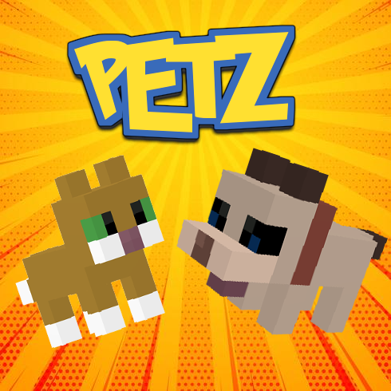
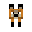
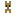
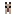
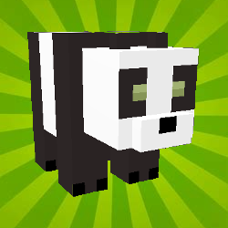
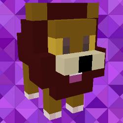
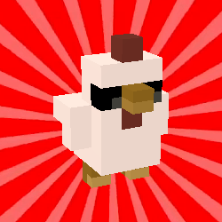
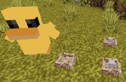

# Petz [petz] - Luanti Voyager Fork

  

This fork is maintained as part of the [Luanti Voyager](https://github.com/toddllm/luanti-voyager) project.

**Fork Location**: `/home/tdeshane/luanti/petz-fork`

This fork was originally created from [yl-whosit/petz](https://github.com/yl-whosit/petz) and is now maintained to ensure compatibility with Luanti Voyager servers.

## Petz [petz]

  

Cute kawaii mobs for Minetest - now for Luanti!

## Features at a Glance

- 🐾 **50+ Different Animals** - From common pets to exotic creatures
- 🎮 **Interactive Gameplay** - Pick up, carry, and command your pets
- 🥕 **Taming System** - Build trust with different food items
- 🏠 **Pet Orders** - Tell pets to follow, stay, or wander
- 🎒 **Capture & Transport** - Use lassos and nets to move pets
- 🥚 **Breeding System** - Raise families of adorable animals
- 🎨 **Multiple Variants** - Different colors and types of each pet

## Licenses

- Code: GPL v3.0
- Textures: CC BY-SA 4.0
- Sounds: They have different licenses, see the 'sounds/LICENSE.MD' file.

## The original RAW Blender Models

There are in a separate github repository:

[Petz RAW](https://github.com/runsy/petz_raw)

## Usage Guide

### Spawn Eggs

Spawn eggs are available for most pets using the format `petz:<petname>_set`:

| Pet | Icon | Spawn Command | Description |
|-----|------|---------------|-------------|
| Fox |  | `/giveme petz:foxy_set` | Tamed fox companion |
| Kitten |  | `/giveme petz:kitty_set` | Cute tamed kitten |
| Puppy |  | `/giveme petz:puppy_set` | Loyal tamed puppy |
| Lamb |  | `/giveme petz:lamb_set` | Fluffy lamb friend |
| Duck | 🦆 | `/giveme petz:ducky_set` | Waddles around water |

### Taming Animals

Different animals require different items for taming:

#### Carnivores (Fox, Lion, Wolf, etc.)
- **Required items**: Raw meat from the `group:food_meat_raw`
- **Available meats**:
  - `petz:raw_chicken`
  - `petz:raw_porkchop`
  - `petz:beef`
- **How to tame**: Right-click the animal with raw meat in hand

#### Herbivores
- **Lambs**: Use wheat (`farming:wheat`)
- **Pandas**: Use papyrus (`default:papyrus`)
- **Parrots**: Use wheat seeds (`farming:seed_wheat`)

### Picking Up and Carrying Pets

Foxes can now be picked up and carried! This feature uses the attachment API:
- **To pick up**: Right-click a tamed fox with an **empty hand**
- **While carrying**: The fox hovers in front of you and follows your movements
- **To put down**: Right-click again (with empty hand) to place the fox in front of you
- **Note**: Only the owner can pick up their pet
- **Important**: Holding any item (food, tools, etc.) will bypass pickup and use normal interactions

### Capturing Pets (Item Form)

To capture pets and store them as items:
- **Foxes, Dogs, Cats**: Use a lasso (`petz:lasso`)
- **Small animals (Birds, etc.)**: Use a net (`petz:net`, `mobs:net`, or `fireflies:bug_net`)
- **How to capture**: Right-click the tamed pet with the appropriate capture item
- The pet will be converted to an item in your inventory that you can place elsewhere

### Giving Orders to Pets

Once tamed, you can give orders to your pets by right-clicking with an empty hand and using the orders menu:
- **Follow me**: Pet follows you around
- **Stand here**: Pet stays in place (foxes will sit!)
- **Do your own thing**: Pet wanders freely

### Important Notes

1. **Right-clicking** only works when holding the correct taming item
2. Animals will follow players holding their favorite food
3. Some animals like lions require multiple attempts or a whip to tame
4. Check `/var/games/minetest-server/.minetest/mods/petz/petz.conf` for all animal preferences
5. You cannot capture animals with saddlebags equipped
6. You need room in your inventory to capture a pet

## Visual Examples

### Popular Pets

   
   
  

### Farm Life

  

Create your own farm with ducks, chickens, and other farm animals! They produce eggs and can be bred for sustainable farming.

### Server Installation

The mod is installed at: `/var/games/minetest-server/.minetest/mods/`
- `petz/` - Main pet mod
- `kitz/` - Required API
- `bale/` - Additional content
